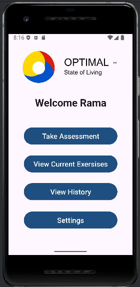
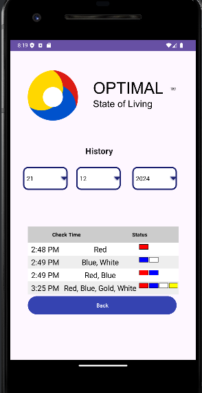
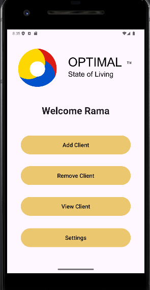
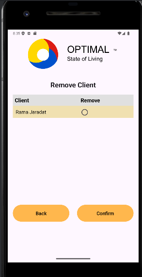
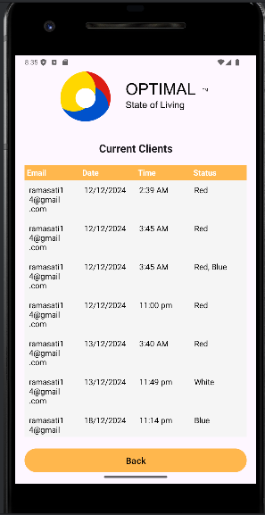

# Optimal State of Living

## Overview

Optimal State of Living is an innovative application designed to help users monitor and improve their state of mind. The project includes both an Android application and a client website, providing users with tools to track their emotional states, access mental health exercises and techniques, and make lifestyle improvements.

## Features

1- Mood Tracking:

Track emotional states and mental well-being using visual tools like cardn selectors and 2x2 grids.

2- Real-Time Data Storage:

Firebase Realtime Database stores user information and history, including timestamps and statuses.

3- Customization:

Users can change the app theme (light or dark).

4- User Roles:

Different interfaces for providers and general users. Providers are directed to a dedicated Provider Home Screen.

5-Mental Health Resources:

Exercises, techniques, and insights for mental well-being.

## Project Goals

The app aims to:

Provide users with a reliable way to monitor their mental state.

Encourage positive habits and mental health improvements.

## Technologies Used

1- Frontend:

Android Studio for the mobile app.

Modern web technologies for the client website.

2- Backend:

Firebase Realtime Database and Firestore for data management.

## Some Application Pages example

### Login Page
The login page allows users to securely sign in to their accounts.

### User HomePage
Users can have multiple function can do it like take assessment, current exercise,etc.

### User History
Users can view their activity and mood tracking history in the User History section.

### Provider HomePage
also provider can do multiple function

### Provider Remove Client
Providers can delete clients what are added already to their dataset when there need

### Provider View Cliet
Where providers can view their clients history like client state and the date of it

.

